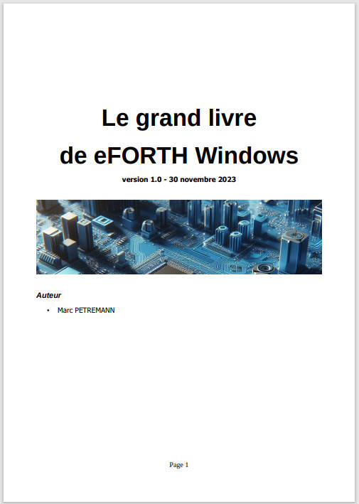

Table des matières
Commentaires et mise au point...........................................................................5
Ecrire un code FORTH lisible......................................................................................5
Indentation du code source...................................................................................6
Les commentaires.....................................................................................................7
Les commentaires de pile......................................................................................7
Signification des paramètres de pile en commentaires.............................................8
Commentaires des mots de définition de mots........................................................9
Les commentaires textuels.........................................................................................9
Commentaire en début de code source.................................................................10
Outils de diagnostic et mise au point........................................................................10
Le décompilateur.................................................................................................10
Dump mémoire...................................................................................................11
Moniteur de pile..................................................................................................11
Dictionnaire / Pile / Variables / Constantes......................................................13
Étendre le dictionnaire.............................................................................................13
Gestion du dictionnaire........................................................................................13
Piles et notation polonaise inversée..........................................................................14
Manipulation de la pile de paramètres..................................................................15
La pile de retour et ses utilisations...........................................................................15
Utilisation de la mémoire.........................................................................................16
Variables.............................................................................................................16
Constantes..........................................................................................................17
Valeurs pseudo-constantes..................................................................................17
Outils de base pour l'allocation de mémoire..........................................................17
Affichage des nombres et chaînes de caractères...............................................19
Changement de base numérique..............................................................................19
Définition de nouveaux formats d'affichage...............................................................20
Affichage des caractères et chaînes de caractères.....................................................22
Variables chaînes de caractères................................................................................24
Code des mots de gestion de variables texte.........................................................24
Ajout de caractère à une variable alphanumérique................................................26
Les mots de création de mots............................................................................28
Utilisation de does>................................................................................................28
Exemple de gestion de couleur.............................................................................29
Exemple, écrire en pinyin.....................................................................................30
Contenu détaillé des vocabulaires eForth Windows..........................................32
Version v 7.0.7.15...................................................................................................32
FORTH...............................................................................................................32
windows.............................................................................................................33
Ressources........................................................................................................36
En anglais...............................................................................................................36
En chinois...............................................................................................................36
Page 2
En français..............................................................................................................36
GitHub....................................................................................................................36
