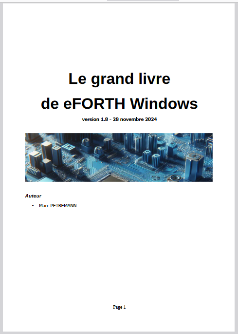

<h2>Sommaire</h2>
Introduction........................................................................................................6
Aide à la traduction...................................................................................................6
Pourquoi programmer en langage FORTH sur eForth Windows?.........................7
Préambule................................................................................................................7
Limites entre langage et application...........................................................................7
C'est quoi un mot FORTH?.........................................................................................8
Un mot c'est une fonction?........................................................................................8
Le langage FORTH comparé au langage C..................................................................9
Ce que FORTH permet de faire par rapport au langage C.......................................10
Mais pourquoi une pile plutôt que des variables?...................................................11
Êtes-vous convaincus?.........................................................................................11
Existe-t-il des applications professionnelles écrites en FORTH?...................................12
Installation sous Windows................................................................................14
Paramétrer eForth Windows.................................................................................14
Un vrai Forth 64 bits avec eForth Windows.......................................................17
Les valeurs sur la pile de données............................................................................17
Les valeurs en mémoire.......................................................................................17
Traitement par mots selon taille ou type des données...........................................18
Conclusion..............................................................................................................19
Edition et gestion des fichiers sources pour eForth Windows...........................21
Les éditeurs de fichiers texte....................................................................................21
Utiliser un IDE.....................................................................................................22
Stockage sur GitHub............................................................................................24
Quelques bonnes pratiques......................................................................................24
Le fichier main.fs.................................................................................................25
Exemple d’organisation d’un projet...........................................................................26
Commentaires et mise au point.........................................................................28
Ecrire un code FORTH lisible....................................................................................28
Indentation du code source.................................................................................29
Les commentaires...................................................................................................30
Les commentaires de pile....................................................................................30
Signification des paramètres de pile en commentaires...........................................31
Commentaires des mots de définition de mots......................................................32
Les commentaires textuels.......................................................................................32
Commentaire en début de code source.................................................................33
Outils de diagnostic et mise au point........................................................................33
Le décompilateur.................................................................................................34
Dump mémoire...................................................................................................34
Moniteur de pile..................................................................................................34
Dictionnaire / Pile / Variables / Constantes......................................................37
Étendre le dictionnaire.............................................................................................37
Gestion du dictionnaire........................................................................................37
Piles et notation polonaise inversée..........................................................................38
Manipulation de la pile de paramètres..................................................................39
La pile de retour et ses utilisations...........................................................................39
Utilisation de la mémoire.........................................................................................40
Variables.............................................................................................................40
Constantes..........................................................................................................41
Valeurs pseudo-constantes..................................................................................41
Outils de base pour l'allocation de mémoire..........................................................41
Les variables locales avec eForth Windows.......................................................43
Introduction............................................................................................................43
Le faux commentaire de pile....................................................................................43
Action sur les variables locales.................................................................................44
Structures de données pour eForth Windows....................................................48
Préambule..............................................................................................................48
Les tableaux en FORTH...........................................................................................48
Tableau de données à une dimension...................................................................48
Mots de définition de tableaux.............................................................................49
Lire et écrire dans un tableau...............................................................................49
Exemple pratique de gestion d'écran....................................................................50
Gestion de structures complexes..............................................................................52
Règles de nommage des structures et accesseurs.................................................54
Choix de la taille des champs dans une structure...................................................55
Définition de sprites................................................................................................57
Les nombres réels avec eForth Windows...........................................................60
Les réels avec eForth Windows................................................................................60
Precision des nombres réels avec eForth Windows................................................60
Constantes et variables réelles.............................................................................61
Opérateurs arithmétiques sur les réels..................................................................61
Opérateurs mathématiques sur les réels...............................................................62
Opérateurs logiques sur les réels..........................................................................62
Transformations entiers ↔ réels...........................................................................63
Affichage des nombres et chaînes de caractères...............................................64
Changement de base numérique..............................................................................64
Définition de nouveaux formats d'affichage...............................................................65
Affichage des caractères et chaînes de caractères.....................................................67
Variables chaînes de caractères................................................................................69
Code des mots de gestion de variables texte.........................................................70
Ajout de caractère à une variable alphanumérique................................................72
Comparaisons et branchements........................................................................74
Branchements conditionnels vers l'avant...................................................................75
Branchement conditionnel vers l'arrière....................................................................77
Branchement en avant depuis une boucle indéfinie...................................................77
Répétition contrôlée d'une action.............................................................................78
Structure uni-conditionnelle à choix multiples............................................................79
La récursivité..........................................................................................................80
Les tests logiques....................................................................................................81
Les vocabulaires avec eForth Windows.............................................................82
Liste des vocabulaires..............................................................................................82
Les vocabulaires essentiels..................................................................................82
Liste du contenu d'un vocabulaire............................................................................83
Utilisation des mots d'un vocabulaire........................................................................83
Chainage des vocabulaires.......................................................................................83
Les mots à action différée.................................................................................85
Définition et utilisation de mots avec defer................................................................86
Définition d'une référence avant...........................................................................86
Un cas pratique.......................................................................................................87
Les mots de création de mots............................................................................90
Utilisation de does>................................................................................................90
Exemple de gestion de couleur.............................................................................92
Affichage de boites modales..............................................................................93
MessageBoxA..........................................................................................................93
Contenu et comportement de la boîte de dialogue.....................................................94
Valeur retournée.................................................................................................95
Explications supplémentaires................................................................................96
Définition du bouton par défaut............................................................................97
Rajout d'une icône dans la boite modale...............................................................98
Etendre le vocabulaire graphics pour Windows...............................................100
Définition des mots dans graphics internals.............................................................101
Trouver les fonctions disponibles dans un fichier dll.................................................102
Dependency Walker...........................................................................................103
Premiers tracés graphiques.............................................................................105
Ouvrir une fenêtre.................................................................................................105
Tracé de lignes......................................................................................................106
Coloration des tracés graphiques............................................................................107
Tracé de formes géométriques........................................................................110
Colorier l'intérieur des formes.................................................................................110
Tracé de rectangles...............................................................................................110
Tracé de polygones...............................................................................................112
Tracé d'ellipses......................................................................................................113
Tracé d'arcs..........................................................................................................114
Afficher du texte dans l'environnement graphique.........................................116
DrawTextA............................................................................................................116
Définition de la zone de tracé du texte................................................................117
Formatage du texte...........................................................................................118
Changer la couleur du texte...................................................................................120
TextOutA..............................................................................................................121
Les fontes de caractères..................................................................................123
Fonte et police......................................................................................................123
CreateFontA..........................................................................................................123
Contenu détaillé des vocabulaires eForth Windows........................................128
Version v 7.0.7.21............................................................................................128
FORTH..................................................................................................................128
windows...............................................................................................................130
Liste des fonctions graphiques de la librairie Gdi32........................................133
Bitmaps................................................................................................................133
Clip.......................................................................................................................134
Coordonnées et transformation..............................................................................135
Couleurs...............................................................................................................136
Pinceaux...............................................................................................................136
Stylos...................................................................................................................137
Lignes et courbes..................................................................................................137
Formes remplies....................................................................................................137
Fontes et textes....................................................................................................138
Contexte appareil..................................................................................................140
Régions................................................................................................................141
Ressources......................................................................................................142
En anglais.............................................................................................................142
En français............................................................................................................142
GitHub..................................................................................................................142
Facebook..............................................................................................................143 

